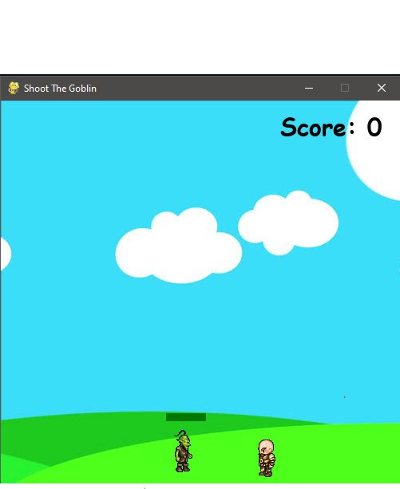
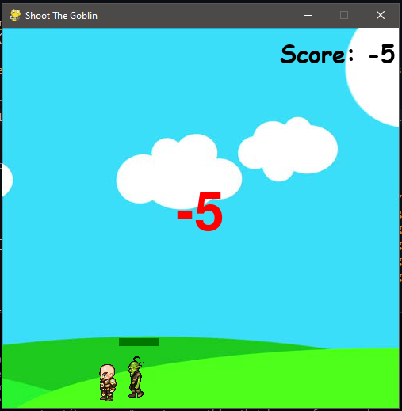
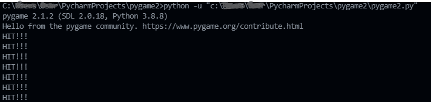

# Shoot the Goblin

<br>
A basic Python Application made using PyGame.

<br>
Requirement:<br>
<ul>
    <li>Python: 3.8.8</li>
    <li>Pygame: 2.1.2</li>
</ul>
To Install Pygame:<br>
```
pip install pygame
```
<br>
<br>

## Images


<figure>
    
    <figcaption>The Game Window<figcaption>
</figure>


<figure>
    
    <figcaption>Negative Score when Goblin Hits the Soldier </figcaption>
</figure>

<figure>
    
    <figcaption>Bullets from the Soldier and Killing the Goblin (i.e. Reducing the life)</figcaption>
</figure>

<figure>
    
    <figcaption>The Console prints ```HIT!``` everytime the goblin gets hit </figcaption>
</figure>